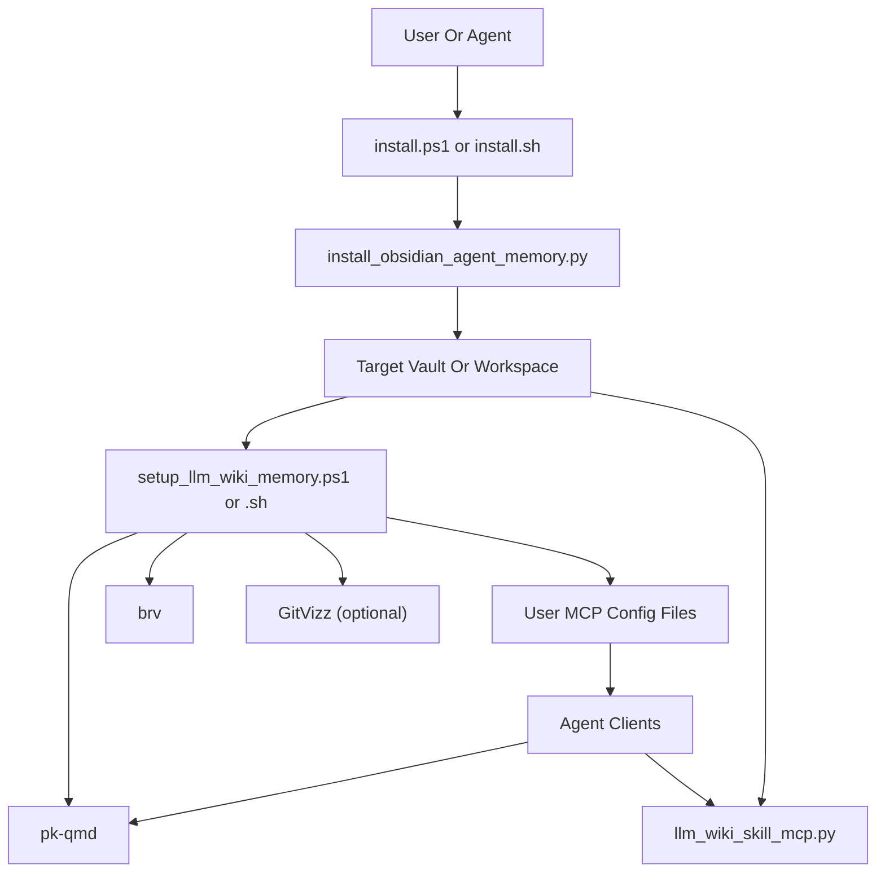

# Architecture

## Primary Happy Path

## Boundary Breakdown

### 1. Hosted bootstrap wrapper

Files:

- `install.ps1`
- `install.sh`

Role:

- download a zip of this repo
- choose install mode
- run the correct Python installer
- run setup helper after install for the standard packet path

### 2. Packet installer

Files:

- `installers/install_obsidian_agent_memory.py`
- `installers/install_g_kade_workspace.py`

Role:

- copy prompts, helper docs, scripts, and bootstrap folders into the target
- create `.llm-wiki/config.json`
- create `.llm-wiki/skills-registry.json`
- create skill pipeline directories
- optionally install packet-owned `gstack` and `g-kade` home wrappers

### 3. Local setup helper

Files:

- `support/scripts/setup_llm_wiki_memory.ps1`
- `support/scripts/setup_llm_wiki_memory.sh`

Role:

- find or install `pk-qmd`
- find or install `brv`
- bootstrap QMD collection and embeddings
- patch user config so agents can reach MCP servers
- optionally start or verify GitVizz

The strongest machine-level connection points are:

- `~/.claude/settings.json`
- `~/.codex/config.toml`
- `~/.factory/mcp.json`

The helper wires two MCP servers:

- `pk-qmd`
- `llm-wiki-skills`

### 4. Local skill-learning plane

File:

- `support/scripts/llm_wiki_skill_mcp.py`

Role:

- expose a local MCP server named `llm-wiki-skills`
- manage skill registry and skill markdown files
- persist reflection/validation/packet artifacts
- enforce the reducer/router contract for long tasks

Main internal flows:

- `lookup`
- `reflect`
- `validate`
- `propose`
- `pipeline_run`
- `feedback`
- `retire`

### 5. Optional hosted runtime

Files:

- `docker/entrypoint.sh`
- `docker/mcp_http_proxy.mjs`
- `docker-compose.yml`
- `deploy/gcp/*`
- `deploy/cloudflare/*`

Role:

- package the same bootstrap into a container
- expose `pk-qmd mcp --http`
- optionally front the VM with Cloudflare Worker and Tunnel

## Important Runtime Ports And URLs

- `pk-qmd` MCP:
  default local URL `http://localhost:8181/mcp`
- Docker proxy split:
  upstream `18181`, public `8181`
- GitVizz:
  frontend `http://localhost:3000`
  backend `http://localhost:8003`

## The Real Center Of Gravity

The repo's real center is not Docker and not the plugin bundle. It is the installer plus setup-helper pair:

- copy the packet into a workspace
- turn that workspace into a tool-wired runtime
- let agent clients talk to `pk-qmd` and `llm-wiki-skills`
