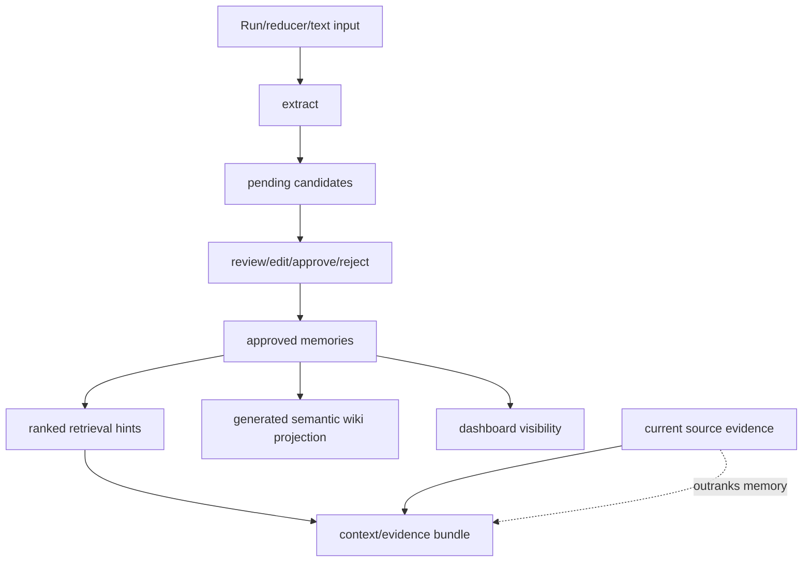

# Architecture

**Analysis Date:** 2026-04-12

## Pattern Overview

**Overall:** Local-first packet installer with optional hosted gateway and repo-overlay scaffolding

**Key Characteristics:**

- Source repo contains packet assets plus installers; generated vault state is created later in the target workspace
- Python owns the authoritative scaffold logic while PowerShell and Bash mirror environment-specific setup
- Local and hosted responsibilities are intentionally separated across `installers/`, `support/scripts/`, `docker/`, and `deploy/`

## Layers

**Distribution Layer:**

- Purpose: Download or build the packet installers that users actually invoke
- Contains: `install.ps1`, `install.sh`, `scripts/build_release_bootstraps.py`, `.github/workflows/release-installers.yml`
- Depends on: GitHub zip/release assets and Python
- Used by: Human or agent bootstrap flows

**Workspace Scaffolding Layer:**

- Purpose: Copy packet assets and generate workspace config/state
- Contains: `installers/install_obsidian_agent_memory.py`, `installers/install_g_kade_workspace.py`
- Depends on: `prompts/`, `support/`, `skills/home/`, `plugins/`, and the repo contract files
- Used by: Hosted wrappers and direct local installer runs

**Runtime Helper Layer:**

- Purpose: Resolve tools, patch MCP configs, bootstrap QMD collections, initialize BRV, and optionally launch GitVizz
- Contains: `support/scripts/setup_llm_wiki_memory.sh`, `support/scripts/setup_llm_wiki_memory.ps1`, `support/scripts/brv_*.sh`, `support/scripts/gitvizz_*.ps1`
- Depends on: Generated `.llm-wiki/config.json`, external CLIs, and the current workspace
- Used by: Installed vaults, `g-kade` workspace bootstrap, and container entrypoints

**Memory Controller Layer:**

- Purpose: Extract, reconcile, review, approve, invalidate, and rank local semantic/preference memories from real usage
- Contains: `support/scripts/llm_wiki_memory_controller.py`, installed mirror `scripts/llm_wiki_memory_controller.py`, and `.llm-wiki/memory-ledger/`
- Depends on: reducer/run artifacts, raw CLI text, generated config, and the filesystem ledger
- Used by: `llm_wiki_packet.py` retrieval, the read-only dashboard, and CLI review workflows

**Gateway / Hosted Layer:**

- Purpose: Expose the local contract through HTTP and deployment surfaces
- Contains: `docker/entrypoint.sh`, `docker/mcp_http_proxy.mjs`, `docker-compose.yml`, `deploy/gcp/*`, `deploy/cloudflare/*`
- Depends on: `pk-qmd`, BRV scripts, optional GitVizz services, and environment configuration
- Used by: Local Docker, GCP VM deploys, and Cloudflare-edge remote access

**Content / Prompt Layer:**

- Purpose: Ship the actual agent-facing prompts, wrappers, and plugin surfaces
- Contains: `prompts/*.md`, `skills/home/*`, `plugins/llm-wiki-organizer/*`, `support/*.md`
- Depends on: Installer copy logic rather than runtime imports
- Used by: Claude/Codex/Factory/Antigravity targets after installation

## Data Flow

**Standard Packet Install:**

1. User runs `install.ps1` or `install.sh`
2. Wrapper downloads a zip of this repo and dispatches to `installers/install_obsidian_agent_memory.py`
3. Installer writes packet assets, bootstrap directories, and `.llm-wiki/config.json` into the target vault
4. `support/scripts/setup_llm_wiki_memory.ps1` or `.sh` resolves `pk-qmd` and `brv`, patches user MCP configs, and optionally verifies GitVizz
5. Agent clients connect to `pk-qmd` and `llm-wiki-skills`

**g-kade Workspace Bootstrap:**

1. `installers/install_g_kade_workspace.py` detects the repo root
2. It reuses packet installer logic for shared files
3. It adds repo-local `.agents`, `.codex`, `.claude`, and `kade/` overlays
4. It optionally runs setup and health helpers against the workspace root

**Hosted Gateway Request:**

1. `docker/entrypoint.sh` bootstraps the mounted workspace
2. It starts `pk-qmd mcp --http` on an internal port
3. `docker/mcp_http_proxy.mjs` exposes `/mcp`, `/graph/*`, `/memory/status`, `/memory/query`, and `/memory/curate`
4. `deploy/cloudflare/mcp-edge-worker.js` can front `/mcp` for remote clients

**State Management:**

- Source repo state is static and tracked in git
- Generated workspace state lives under `.llm-wiki/`, `.brv/`, `wiki/`, and `raw/`
- User-global MCP state is patched into `~/.claude/settings.json`, `~/.codex/config.toml`, and `~/.factory/mcp.json`

**Memory Controller Loop:**

## Key Abstractions

**Packet Installer:**

- Purpose: Turn source assets into a bootstrapped vault or repo workspace
- Examples: `installers/install_obsidian_agent_memory.py`, `installers/install_g_kade_workspace.py`
- Pattern: File-copy plus generated-config orchestrator

**Managed Runtime Dependency Detection:**

- Purpose: Decide whether the richer runtime exists locally, in managed tool roots, or must be installed
- Examples: `repo_runtime_dependency_status()` in `installers/install_obsidian_agent_memory.py`, `repo_runtime_dependency()` in `installers/install_g_kade_workspace.py`
- Pattern: Filesystem probing and contract-aware fallback logic

**Skill Store:**

- Purpose: Manage the local-first skill lifecycle and reducer/router workflow
- Examples: `SkillStore` in `support/scripts/llm_wiki_skill_mcp.py`
- Pattern: Registry-backed filesystem state machine with MCP and CLI entrypoints

**Memory Ledger Controller:**

- Purpose: Keep semantic and preference memory review-gated while still feeding approved memory into retrieval
- Examples: `extract`, `approve`, `invalidate`, and `rank` commands in `support/scripts/llm_wiki_memory_controller.py`
- Pattern: JSON-object ledger plus audit log, with generated wiki projection for approved semantic memories

**Gateway Route Split:**

- Purpose: Present one HTTP surface that proxies QMD, graph, and curated memory operations
- Examples: `/mcp`, `/graph/*`, `/memory/*` in `docker/mcp_http_proxy.mjs`
- Pattern: Thin proxy plus optional bearer auth

## Entry Points

**Hosted Bootstrap Wrappers:**

- Location: `install.ps1`, `install.sh`
- Triggers: Direct local execution or hosted one-line install flows
- Responsibilities: Download packet zip, select install mode, invoke Python installer

**Primary Installers:**

- Location: `installers/install_obsidian_agent_memory.py`, `installers/install_g_kade_workspace.py`
- Triggers: Wrapper scripts or direct CLI use
- Responsibilities: Write packet files, generate config, scaffold repo-local overlays

**Runtime Setup Helpers:**

- Location: `support/scripts/setup_llm_wiki_memory.ps1`, `support/scripts/setup_llm_wiki_memory.sh`
- Triggers: Post-install setup, re-bootstrap, or verification runs
- Responsibilities: Resolve tools, patch MCP configs, initialize QMD and BRV

**Hosted Runtime:**

- Location: `docker/entrypoint.sh`, `docker/mcp_http_proxy.mjs`
- Triggers: `docker compose up`, container commands, remote edge requests
- Responsibilities: Bootstrap the workspace and expose HTTP routes

## Error Handling

**Strategy:** Fail fast at script boundaries, then emit human-readable summary or JSON errors

**Patterns:**

- Python raises `SystemExit` or exceptions for invalid arguments and unsafe install targets in `installers/*.py`
- Bash uses `set -euo pipefail` in `install.sh`, `docker/entrypoint.sh`, and `support/scripts/setup_llm_wiki_memory.sh`
- PowerShell sets `$ErrorActionPreference = "Stop"` and surfaces failures with `Write-Error`
- Node gateway returns structured JSON 4xx/5xx responses in `docker/mcp_http_proxy.mjs`

## Cross-Cutting Concerns

**Logging:**

- CLI and setup flows print action summaries via `print`, `Write-Output`, or shell `echo`
- Gateway-level runtime issues are sent to stderr with `console.error` in `docker/mcp_http_proxy.mjs`

**Validation:**

- Installers validate targets, install scope, and runtime dependency shape in `installers/*.py`
- Gateway enforces request-body limits and optional bearer auth in `docker/mcp_http_proxy.mjs`

**Authentication:**

- Local Docker mode defaults to loopback-only exposure in `docker-compose.yml`
- Hosted edge auth is layered via `LLM_WIKI_AGENT_API_TOKEN` and the Cloudflare Access headers used in `deploy/cloudflare/mcp-edge-worker.js`

---

_Architecture analysis: 2026-04-12_
_Update when installer/setup/gateway patterns change_
