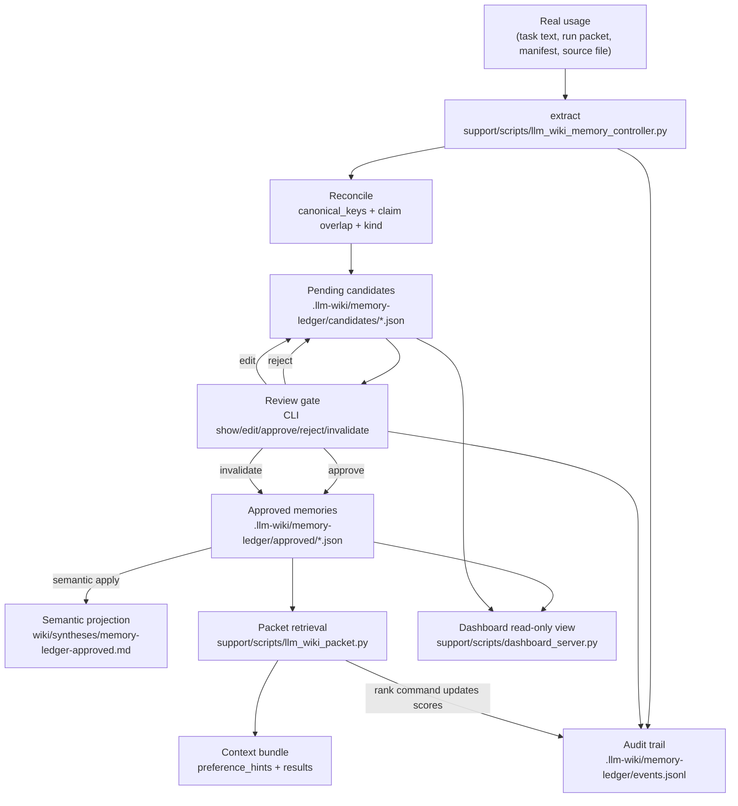
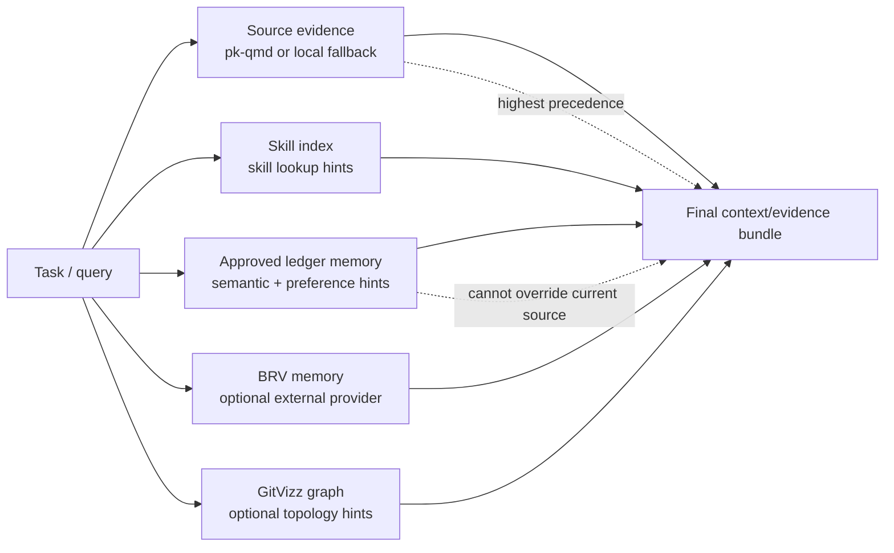
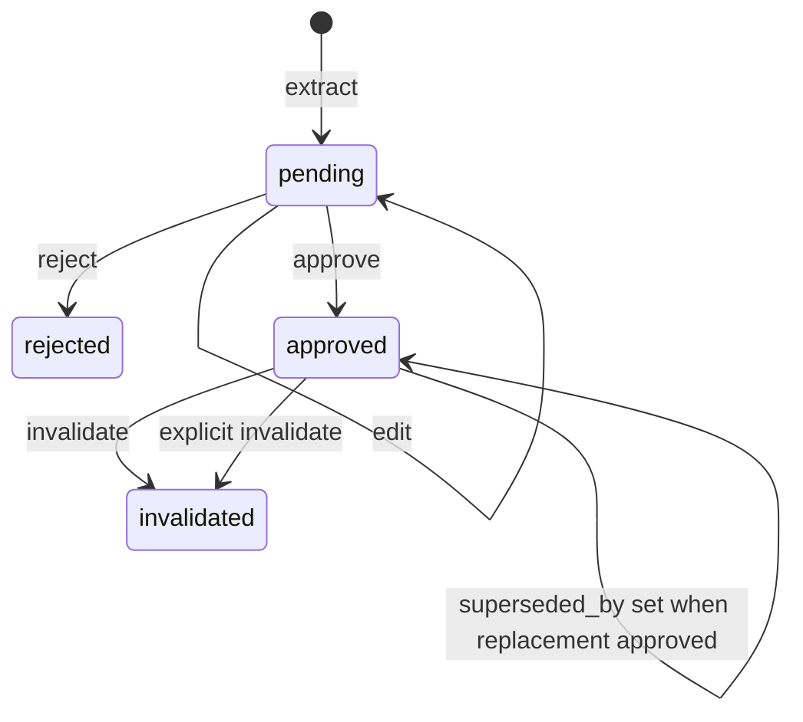

# Visual Memory And Retrieval Map

**Updated:** 2026-04-28

This page is the quickest way to understand the memory loop after the review-gated memory controller work.

## Plain-English Loop

1. Real usage produces text: task notes, reducer packets, run manifests, or pasted CLI text.
2. `llm_wiki_packet.py reduce` automatically calls memory extraction for the run; `llm_wiki_memory_controller.py extract` is still available for manual text/file/run extraction.
3. The local ledger stores candidates under `.llm-wiki/memory-ledger/candidates/`.
4. A human or agent reviews candidates through the controller CLI.
5. Approved memories move to `.llm-wiki/memory-ledger/approved/`.
6. Approved semantic memories can project into `wiki/syntheses/memory-ledger-approved.md`.
7. `llm_wiki_packet.py context/evidence` reads approved ledger memories as preference-plane hints.
8. Source evidence still outranks memory.
9. Dashboard reads the same ledger for visibility, but does not mutate it.

## Full Control Loop



## Retrieval Priority



## Where Tools Are Called

| Action | Entry Point | Reads | Writes | Notes |
|---|---|---|---|---|
| Install controller | `installers/install_obsidian_agent_memory.py` | `support/scripts/llm_wiki_memory_controller.py` | installed `scripts/llm_wiki_memory_controller.py`, config, ledger dirs | Installer ships the controller and bootstrap `.gitkeep` directories. |
| Auto-extract from run | `llm_wiki_packet.py reduce` | reducer run text and generated run artifacts | `candidates/*.json`, run manifest `memory_extraction`, `events.jsonl` | This is the default README-installed loop. |
| Manual extract candidates | `llm_wiki_memory_controller.py extract` | `--text`, `--source-file`, or `.llm-wiki/skill-pipeline/runs/<run-id>/...` | `candidates/*.json`, `events.jsonl` | Deterministic rules only in v1. |
| Reconcile | `reconcile_candidate()` | approved ledger memories | candidate metadata or existing approved provenance | Duplicates merge; conflicts/supersession stay review-gated. |
| Approve | `llm_wiki_memory_controller.py approve` | pending candidate | `approved/*.json`, audit event, semantic projection if applicable | Superseded old memories get `valid_to` and `superseded_by`; unresolved contradictions and credential-like memories require explicit force flags. |
| Project semantic memory | approve/edit/invalidate semantic memory | approved semantic ledger | `wiki/syntheses/memory-ledger-approved.md` | Generated page, not hand-authored wiki content. |
| Rank memory | `llm_wiki_memory_controller.py rank` or packet retrieval | approved ledger | `index.json`, memory `rank_score`, audit event for manual rank | Invalidated/superseded/actively contradictory memories are skipped. |
| Retrieve memory | `llm_wiki_packet.py context/evidence` | approved ledger and BRV/preference files | context/evidence payloads, rank metadata | Ledger memory is surfaced as preference-plane hints. |
| View memory | `dashboard_server.py` | candidates + approved ledger | none | Dashboard is read-only in v1. |

## State Layout

```text
.llm-wiki/
`-- memory-ledger/
    |-- candidates/
    |   `-- <pending-or-rejected-memory>.json
    |-- approved/
    |   `-- <approved-or-invalidated-memory>.json
    |-- events.jsonl
    `-- index.json
```

## Memory Object Lifecycle



## Current Personalization Strengths

- Automatic candidate extraction from real usage input exists.
- Reducer runs now trigger memory candidate extraction automatically.
- Review gate prevents uncontrolled durable memory writes.
- `review_gate` and `min_confidence` config settings affect extraction behavior.
- Reconciliation catches exact duplicates and likely same-kind overlaps.
- Supersession is now operational: approving replacement memories expires older approved memories.
- Active contradictions and credential-like memories require explicit approval flags.
- Retrieval sees approved ledger memories without letting them outrank current source evidence.
- Retrieval updates ledger rank metadata and `index.json`.
- Dashboard exposes pending and approved memory state without adding write-side risk.

## Remaining Gaps To State-Of-The-Art Personalization

| Gap | Why It Matters | Current Status |
|---|---|---|
| Rich semantic extraction | Rule-based extraction misses subtle preferences and implicit durable facts. | V1 deterministic only. |
| Entity-aware reconciliation | `canonical_keys` are lexical, so same concept with different names may not reconcile. | Needs entity/embedding assist. |
| Confidence calibration | Confidence is heuristic, not learned from later success/failure. | Static rules. |
| Feedback-driven reranking | Ranking records scores but does not yet learn from whether retrieved memories helped. | Audit/rank metadata exists, learning loop not implemented. |
| User-facing editor | CLI owns edits; dashboard is read-only. | Intentional v1 safety tradeoff. |
| BRV export/import | Approved local preferences do not automatically curate into BRV. | Deferred by design. |
| Privacy policy depth | Sensitive memories require explicit force approval, but no full policy engine for redaction/retention exists. | Basic detection and guardrails only. |

## Files To Read First

- `support/scripts/llm_wiki_memory_controller.py` - controller, ledger schema, lifecycle commands.
- `support/scripts/llm_wiki_packet.py` - retrieval integration and source-precedence behavior.
- `support/scripts/dashboard_server.py` - read-only dashboard memory cards and API.
- `installers/install_obsidian_agent_memory.py` - installed script/config/ledger bootstrap.
- `tests/test_llm_wiki_memory_controller.py` - lifecycle regression tests.
- `tests/test_llm_wiki_packet.py` - retrieval integration tests.
