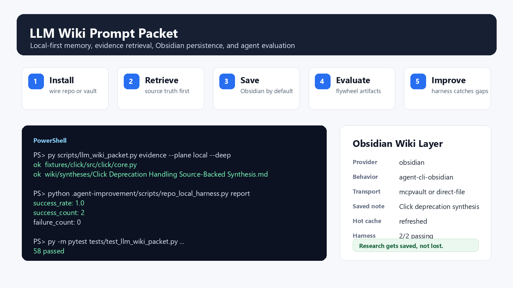

# LLM Wiki Prompt Packet

**A local-first wiki, memory, retrieval, and evaluation layer for coding agents.**

This packet gives agents a durable operating system around your repo or Obsidian vault:

- find source truth before guessing
- save useful research and decisions into a wiki
- keep reusable workflows as skills
- stage durable memory through review
- catch failures with an evaluation loop before they become habits



## Start Here

Most users only need this path:

1. Install into the repo or vault you are already in.
2. Ask your agent normal questions.
3. Let the packet retrieve evidence and offer to save durable findings.

The install command runs setup and the closing health check for you. You do not need to understand the internal indexing system to use it.

## 60-Second Install

Install into the current repo. Run exactly one command for your shell.

PowerShell:

```powershell
$f="$env:TEMP\llm-wiki-install.ps1"; iwr https://raw.githubusercontent.com/kingkillery/llm_wiki_prompt_packet/main/install.ps1 -OutFile $f; & $f -WireRepo
```

macOS, Linux, Git Bash, or WSL:

```bash
curl -fsSL https://raw.githubusercontent.com/kingkillery/llm_wiki_prompt_packet/main/install.sh | bash -s -- --wire-repo
```

Use the command that matches your shell. If your prompt starts with `PS C:\...>`, use PowerShell. If you are in bash, Git Bash, or WSL, use the bash command.

`-WireRepo` / `--wire-repo` does the normal install path and makes `llm-wiki-skills` active for that repo. Active means the repo has packet-managed agent instructions and `.llm-wiki/` scaffolding installed; it does not mean an MCP server is running.

- runs preflight
- copies packet files into the current workspace
- wires agent-facing commands and repo-local instruction scaffolding
- sets up repo-local evidence search
- creates the local review-gated memory ledger
- creates the Obsidian/wiki directory structure
- refreshes the skill index
- runs the closing health check

After it finishes, ask naturally:

```text
Help me use llm-wiki in this repo.
```

Claude users can also run `/wiki-help`, but the slash command is optional.

## Verify It

From the installed workspace root:

PowerShell:

```powershell
powershell -NoProfile -ExecutionPolicy Bypass -File.\scripts\check_llm_wiki_memory.ps1
```

Shell:

```bash
bash./scripts/check_llm_wiki_memory.sh
```

Success means the packet can find its config, scripts, skill index, memory folders, and configured retrieval/wiki surfaces. Optional GitVizz checks are skipped by default unless you opt in.

## Daily Use

Ask your agent the normal task. The packet gives it these habits:

| When the task needs... | The packet should... |
|---|---|
| current repo facts | retrieve source evidence first |
| a reusable conclusion | save a wiki note |
| a durable decision | save or update a decision note |
| a repeated workflow | suggest or create a skill |
| a failed attempt | reduce it into an improvement candidate |
| a deep research answer | save to Obsidian by default unless you opt out |
| help using the packet | answer directly in plain language |

Example prompts:

```text
Help me use this tool.
```

```text
Explain how auth works in this repo and save the durable architecture summary.
```

```text
/wiki-map authentication flow
```

```text
Research this paper, compare it to our previous notes, and persist the useful synthesis.
```

```text
Run the packet evidence search for this bug, then evaluate whether the fix should become a reusable skill.
```

## Obsidian Wiki Layer

The intended layering is:

| Layer | Responsibility |
|---|---|
| `llm_wiki_prompt_packet` | installer, MCP wiring, retrieval, memory ledger, evaluation loop |
| `agent-cli-obsidian` | recommended wiki behavior and note taxonomy |
| `mcpvault` or `mcp-obsidian` | vault read/write transport |
| direct-file fallback | local vault writes when MCP is unavailable |

Vault path rule: if `.llm-wiki/config.json`, MCP settings, or user settings already define the Obsidian vault path, use that. If no path is established, ask the user where to create or access the vault before reading or writing. Do not silently assume the current repo is the user's Obsidian vault.

Agents should offer to save substantial answers, research findings, comparisons, durable decisions, and source-backed insights into Obsidian/wiki notes. The operating rule is simple:

> Good answers and insights should not disappear into chat history.

For deep research, saving is the default outcome unless the user opts out.

Supported note types:

- `synthesis`
- `concept`
- `source`
- `decision`
- `session`
- `query`

Research flows can also use source/entity/concept/question pages plus a synthesis page when useful.

Saved query notes live under `wiki/queries/`. Use `--promote-to synthesis`, `--promote-to concept`, or `--promote-to decision` when a repeated answer should graduate into a durable wiki page.

Provider/model settings resolve in this order:

1. shell environment: `LLM_WIKI_PROVIDER`, `LLM_WIKI_MODEL`, `LLM_WIKI_TIMEOUT_MS`, `LLM_WIKI_LANGUAGE`, `LLM_WIKI_ENDPOINT`
2. local `.env`
3. `.llm-wiki/agent-settings.json`
4. `.llm-wiki/config.json` `provider_settings`
5. built-in defaults

Check the resolved values with:

```powershell
py.\scripts\llm_wiki_settings.py --json
```

Obsidian symlink mode is advanced and opt-in. The safe default is direct writes to an explicitly configured vault path or an MCP vault transport; do not create symlinks into a vault unless the user specifically asks for that layout.

## What Gets Installed

The packet installs guidance files, commands, scripts, config, and health checks into an Obsidian vault or repo workspace so agents can operate against one stable contract.

Core surfaces:

- `AGENTS.md`, `CLAUDE.md`, `LLM_WIKI_MEMORY.md`, `SYSTEM_CONTRACT.md`
- `.llm-wiki/config.json`
- `.llm-wiki/skill-pipeline/`
- `.llm-wiki/memory-ledger/`
- `wiki/index.md`, `wiki/log.md`, `wiki/hot.md`
- `wiki/sources/`, `wiki/concepts/`, `wiki/syntheses/`, `wiki/decisions/`, `wiki/sessions/`
- `scripts/llm_wiki_packet.py`
- `scripts/llm_wiki_provider.py`
- `scripts/llm_wiki_settings.py`
- `scripts/llm_wiki_save.py`
- `scripts/llm_wiki_lint.py`, `scripts/llm_wiki_compile.py`, `scripts/llm_wiki_graph.py`
- setup and health-check wrappers for PowerShell and shell

Optional home skill wrappers can be installed with `--install-home-skills` or `LLM_WIKI_INSTALL_HOME_SKILLS=1` for:

- `~/.agents/skills/`
- `~/.codex/skills/`
- `~/.claude/skills/`
- `~/.pi/agent/skills/`

## Command Cheat Sheet

Run these from an installed workspace root.

```powershell
py.\scripts\llm_wiki_packet.py check
py.\scripts\llm_wiki_packet.py context --task "explain the current auth flow" --json
py.\scripts\llm_wiki_packet.py evidence --query "Click deprecation warnings" --plane local --deep --json
py.\scripts\llm_wiki_save.py --title "Auth Flow Synthesis" --type synthesis --body-file.\notes\auth-summary.md
py.\scripts\llm_wiki_save.py --title "What did we learn about auth?" --type query --question "What did we learn about auth?" --body-file.\notes\auth-answer.md --promote-to synthesis
py.\scripts\llm_wiki_generate.py --title "Auth Architecture Map" --scope "authentication flow" --body-file.\notes\auth-map.md --source "src/auth/middleware.ts"
py.\scripts\llm_wiki_generate.py --title "Auth Architecture Map" --mode upsert-section --section-title "Runtime Flow" --body-file.\notes\auth-runtime.md
py.\scripts\llm_wiki_lint.py --json
py.\scripts\llm_wiki_compile.py status --json
py.\scripts\llm_wiki_graph.py build --write --json
py.\scripts\llm_wiki_impact.py diff --base HEAD~1 --write --json
py.\scripts\llm_wiki_provider.py search "Auth Flow Synthesis" --limit 10
```

## Evaluation Loop

The packet is built to improve under pressure:

```text
manifest -> retrieve -> answer -> save -> reduce -> evaluate -> promote or reject
```

The playground under `.llm-wiki/playgrounds/obsidian-provider-swarm/` exercises this loop against a real cloned repo fixture. It verifies that:

- source-backed findings can be saved to Obsidian
- saved notes are retrievable
- deep local evidence includes fixture repos
- the self-improvement harness can catch and confirm fixes

Latest focused verification for this work: `58 passed`.

## Which Path Should I Use?

| If you want to... | Use this |
|---|---|
| install into the repo you are currently in | Quick Install with `-WireRepo` / `--wire-repo` |
| install into an Obsidian vault only | vault-only install |
| re-run setup after config/tool changes | `scripts/setup_llm_wiki_memory.ps1` or `.sh` |
| check stack health | `scripts/check_llm_wiki_memory.ps1` or `.sh` |
| run locally in Docker | `docker-compose.quickstart.yml` |
| activate a different repo from this checkout | `llm_wiki_packet.py init --project-root <path>` |
| host it on a VM | Google Cloud VM section |
| put Cloudflare in front of a hosted VM | Cloudflare edge section |

### Active and inactive state

`llm-wiki-skills` is active after the harness has been wired into a repo with `-WireRepo`, `--wire-repo`, `scripts/setup_llm_wiki_memory.*`, or `scripts/llm_wiki_packet.py init --project-root <repo>`.

When active, agents should follow the repo-local `AGENTS.md` / `CLAUDE.md` contract: look up reusable skills before substantial or repeated work, capture useful shortcuts with the skill CLI, and record feedback or retirement when a skill helps, misleads, or becomes stale.

The switch control surface is:

```powershell
python.\scripts\llm_wiki_packet.py enable
python.\scripts\llm_wiki_packet.py status
python.\scripts\llm_wiki_packet.py disable
```

`enable` restores the packet-managed switch block and marks the harness active. `disable` leaves an inactive packet-managed switch block and marks the harness inactive without deleting wiki notes, logs, registries, or user-authored memory. `start` and `new` are aliases for `enable`; `stop` and `quit` are aliases for `disable`.

## Vault-Only Install

Use this when you want the legacy packet mode for an Obsidian vault without repo wiring.

PowerShell:

```powershell
$f="$env:TEMP\llm-wiki-install.ps1"; iwr https://raw.githubusercontent.com/kingkillery/llm_wiki_prompt_packet/main/install.ps1 -OutFile $f; & $f
```

Shell:

```bash
curl -fsSL https://raw.githubusercontent.com/kingkillery/llm_wiki_prompt_packet/main/install.sh | bash
```

## Core Concepts

| Concept | Meaning |
|---|---|
| Evidence | Facts from your repo, docs, notes, and prompts. |
| Memory | Durable preferences and repeated decisions, staged through review. |
| Skills | Reusable task procedures that agents can discover and apply. |
| Graph | Structural repo understanding from GitVizz when enabled. |
| Wiki | Human-readable durable knowledge, usually in Obsidian markdown. |
| Packet | The glue layer that makes the surfaces behave as one system. |

## Architecture

The stack contract baked into this packet is:

- use `pk-qmd` first for repo-specific evidence, docs, prompts, notes, and exact local behavior
- use `llm-wiki-skills` for reusable task shortcuts, feedback, and retirement
- treat `Kade-HQ` and `G-Stack` as part of the same system contract, not as an unrelated optional add-on
- prefer direct source evidence over memory when they conflict
- treat `GitVizz` as the local graph surface, with frontend and backend URLs configured explicitly
- do not expect end users to manage raw tool choices

### Hugging Face integrations (optional)

Three opt-in HF surfaces are wired into the packet:

1. **HF Hub MCP server (Claude Code + Factory)** - auto-wired by the setup helper when `HF_TOKEN` is set in the launching shell. Bridges the hosted `https://huggingface.co/mcp` endpoint into `~/.claude/settings.json` and `~/.factory/mcp.json` via `npx mcp-remote@0.1.38`. The token is never persisted to disk - the on-disk config holds `Bearer ${HF_TOKEN}` only as an env-var template that the MCP client expands at launch. Token rotation = shell-env change, not a re-install.
 - **Codex is intentionally not wired**: Codex's stdio MCP launcher does not expand `${VAR}` in args or env, so an auto-wired entry would silently fail authentication. Codex users wanting HF Hub MCP should configure it manually using Codex's HTTP MCP + `bearer_token_env_var` path.
 - **Spaces-in-args defang**: the wiring uses `Authorization:${HF_AUTH_HEADER}` (no space) plus an env entry holding `Bearer ${HF_TOKEN}`, per the upstream `mcp-remote` recommendation, to avoid a documented `npx`-args-mangling bug on Claude Desktop / Cursor on Windows.
2. **Local embeddings via `text-embeddings-inference` (TEI)** - opt-in service in `docker-compose.yml` behind the `tei` profile. Spin up with `COMPOSE_PROFILES=tei docker compose up tei`. Defaults to `BAAI/bge-small-en-v1.5` (override with `LLM_WIKI_TEI_MODEL`); binds loopback `127.0.0.1:8182` (override with `LLM_WIKI_TEI_PORT` / `LLM_WIKI_TEI_BIND_HOST`). The first `/embed` call after start triggers a one-time model download (~100MB-1GB depending on model) and may take 1-2 minutes. To use as the embedder for `pk-qmd`'s `vec` mode, set `LLM_WIKI_QMD_EMBED_URL=http://127.0.0.1:8182/embed` in your shell before invoking pk-qmd - this is a manual integration today, not auto-wired.
3. **`hf` CLI detection in preflight** - the install preflight detects `hf` as an optional tool with platform-specific install hints (defaults to `pip install -U "huggingface_hub[cli]"`, which is the canonical cross-platform installer). With `hf` on PATH, downstream automation (dataset queries, model downloads, Hub releases) becomes available without further setup.

## What the packet installs

### Shared root

- `AGENTS.md`
- `CLAUDE.md`
- `LLM_WIKI_MEMORY.md`
- `SKILL_CREATION_AT_EXPERT_LEVEL.md`

### Claude Code

- `.claude/settings.json`
- `.claude/commands/wiki-ingest.md`
- `.claude/commands/wiki-query.md`
- `.claude/commands/wiki-lint.md`
- `.claude/commands/wiki-skill.md`
- `.claude/commands/wiki-save.md`
- `.claude/commands/wiki-map.md`
- `.claude/commands/wiki-help.md`

### Codex

- `.codex/config.toml`
- `.codex/hooks.json`
- `.agents/skills/llm-wiki-organizer/SKILL.md`
- `.agents/skills/llm-wiki-organizer/assets/system-prompt.md`
- `.agents/skills/llm-wiki-organizer/assets/tool-directives.md`
- `.agents/skills/llm-wiki-organizer/assets/output-contract.md`

### Antigravity

- `.agent/workflows/wiki-ingest.md`
- `.agent/workflows/wiki-query.md`
- `.agent/workflows/wiki-lint.md`
- `.agent/workflows/wiki-skill.md`
- `.agent/workflows/wiki-save.md`
- `.agent/workflows/wiki-map.md`
- `.agent/workflows/wiki-help.md`

### Stack config and health checks

- `.llm-wiki/config.json`
- `.llm-wiki/package.json`
- `.llm-wiki/qmd-embed-state.json`
- `.llm-wiki/skills-registry.json`
- `.llm-wiki/memory-ledger/`
- `scripts/llm_wiki_packet.py`
- `scripts/llm_wiki_packet.ps1`
- `scripts/llm_wiki_packet.sh`
- `scripts/llm_wiki_packet.cmd`
- `scripts/llm_wiki_memory_controller.py`
- `scripts/llm_wiki_generate.py`
- `scripts/check_llm_wiki_memory.ps1`
- `scripts/check_llm_wiki_memory.sh`
- `scripts/llm_wiki_skill_mcp.py`
- `scripts/llm_wiki_agent_failure_capture.py`
- `scripts/llm_wiki_agent_updater.py`
- `scripts/llm_wiki_agent_updater_hook.py`
- `scripts/wire_repo_agent_hooks.py`
- `scripts/auto_reducer_watcher.py`
- `scripts/build_skill_index.py`
- `scripts/skill_index.py`
- `scripts/skill_trigger.py`
- `scripts/dashboard_server.py`
- `scripts/run_llm_wiki_agent.ps1`
- `scripts/run_llm_wiki_agent.sh`
- `scripts/run_llm_wiki_agent.cmd`
- `scripts/setup_llm_wiki_memory.ps1`
- `scripts/setup_llm_wiki_memory.sh`
- `scripts/qmd_embed_runner.mjs`
- `scripts/gitvizz_api.ps1`
- `scripts/gitvizz_api.sh`
- `scripts/launch_gitvizz.ps1`
- `scripts/launch_gitvizz.sh`

### Lifecycle updater hooks

Claude and Codex installs include lifecycle hooks for `SessionStart`, `UserPromptSubmit`, `Stop`, and `SessionEnd`. The hook records the event under `.llm-wiki/state/agent-updater/` and launches `scripts/llm_wiki_agent_updater.py` as a background updater worker.

The updater is designed as a cheap context-agent lane: it extracts durable repo decisions, preferences, follow-up obligations, and useful implementation facts from agent lifecycle events. Set `SILICONFLOW_API_KEY` or `LLM_WIKI_SILICONFLOW_API_KEY` to enable the SiliconFlow extraction path. Without a key, the updater still runs and falls back to the local rule-based memory controller. Set `LLM_WIKI_UPDATER_ENABLED=0` to disable launch enforcement for a session.

Use `python installers/wire_repo_agent_hooks.py --workspace <repo-root> --agents claude,codex --self-test` from a packet checkout, or `python plugins/llm-wiki-organizer/scripts/install_repo_hooks.py --workspace <repo-root> --agents claude,codex --self-test` from the plugin package, to wire an existing repo after `kade-hq` or `g-kade` bootstrap and verify the hook command can write updater state.

Typical repo wiring:

```powershell
python installers\wire_repo_agent_hooks.py --workspace . --agents claude,codex --self-test
```

Plugin package wiring:

```powershell
python plugins\llm-wiki-organizer\scripts\install_repo_hooks.py --workspace . --agents claude,codex --self-test
```

Successful self-test output includes `self-test ok` and creates `.llm-wiki/state/agent-updater/hook-events.jsonl`. If live Codex sessions do not fire hooks, run the self-test first: a passing self-test means the installed hook command is valid and the remaining issue is Codex project config/trust activation, not the updater script.

### Home skill roots

- `~/.agents/skills/kade-hq/SKILL.md`
- `~/.agents/skills/gstack/SKILL.md`
- `~/.agents/skills/g-kade/SKILL.md`
- `~/.agents/skills/llm-wiki-skills/SKILL.md`
- `~/.codex/skills/kade-hq/SKILL.md`
- `~/.codex/skills/gstack/SKILL.md`
- `~/.codex/skills/g-kade/SKILL.md`
- `~/.codex/skills/llm-wiki-skills/SKILL.md`
- `~/.claude/skills/kade-hq/SKILL.md`
- `~/.claude/skills/gstack/SKILL.md`
- `~/.claude/skills/g-kade/SKILL.md`
- `~/.claude/skills/llm-wiki-skills/SKILL.md`

### Bootstrapped vault directories

- `raw/`
- `raw/assets/`
- `wiki/`
- `wiki/index.md`
- `wiki/log.md`
- `wiki/sources/`
- `wiki/entities/`
- `wiki/concepts/`
- `wiki/syntheses/`
- `wiki/comparisons/`
- `wiki/timelines/`
- `wiki/questions/`
- `wiki/skills/index.md`
- `wiki/skills/active/`
- `wiki/skills/feedback/`
- `wiki/skills/retired/`
- `templates/`
- `scripts/`

## Bootstrap path

The hosted installer is the default path. If you do nothing special, it:

1. copies the packet into the current repo or vault
2. writes `.llm-wiki/config.json`
3. installs or verifies the runtime helpers
4. wires MCP/config surfaces
5. bootstraps retrieval and memory helpers
6. builds or refreshes `.llm-wiki/skill-index.json`
7. creates `.llm-wiki/memory-ledger/` and installs `scripts/llm_wiki_memory_controller.py`
8. runs the health check

During setup and health-check runs, the packet now also **builds or refreshes the skill suggestion index automatically**. Interactive agent launches and the dashboard will lazily rebuild the index if the active skills, retired skills, feedback log, or config changed. Users should not need to understand or manually maintain `.llm-wiki/skill-index.json`.

The installed memory loop is also local-first and review-gated by default:

```text
llm_wiki_packet reduce
 -> auto-extracts semantic/preference memory candidates
 -> writes.llm-wiki/memory-ledger/candidates/*.json
 -> CLI review approves/rejects/edits/invalidates
 -> approved ledger memories feed context/evidence retrieval
 -> dashboard shows pending/approved memory state read-only
```

Useful commands from the installed workspace root:

```powershell
python.\scripts\llm_wiki_memory_controller.py list --status pending
python.\scripts\llm_wiki_memory_controller.py show <memory-id>
python.\scripts\llm_wiki_memory_controller.py approve <memory-id>
python.\scripts\llm_wiki_memory_controller.py rank --query "current task"
```

The same controller is available through the packet CLI passthrough:

```powershell
python.\scripts\llm_wiki_packet.py memory list --status pending
```

Local-first use remains supported. When you want a single hosted surface, the intended Docker mode should be able to host the qmd + gitvizz stack together while keeping the same contract boundaries.

### Docker quickstart

```bash
docker compose -f docker-compose.quickstart.yml up
```

This spins up the core stack on `http://127.0.0.1:8181` with your current directory mounted as the vault.

### Unattended install (CI / devcontainer)

```bash
curl -fsSL https://raw.githubusercontent.com/kingkillery/llm_wiki_prompt_packet/main/install.sh | bash -s -- --unattended
```

Required environment variables for unattended mode:

| Variable | Default | Description |
|---|---|---|
| `LLM_WIKI_VAULT` | `$PWD` | Vault / project path |
| `LLM_WIKI_TARGETS` | `claude,codex,droid,pi` | Agent targets |
| `LLM_WIKI_INSTALL_MODE` | `packet` | `packet` or `g-kade` |
| `LLM_WIKI_GLOBAL_WIRE` | `0` | Wire into `~/.claude/CLAUDE.md` |
| `LLM_WIKI_FORCE` | `0` | Force overwrite |
| `LLM_WIKI_SKIP_SETUP` | `0` | Skip setup helper |
| `LLM_WIKI_SKIP_GITVIZZ` | `1` | Skip optional GitVizz setup/checks; set `0` to require graph health |
| `LLM_WIKI_SKIP_HOME_SKILLS` | `0` | Skip home skill install |
| `HF_TOKEN` | — | Hugging Face Hub (optional) |

Use the installed helpers from the vault root when you want machine-level setup, repeatable verification, or a re-run after changing config:

- `scripts/setup_llm_wiki_memory.ps1`
- `scripts/setup_llm_wiki_memory.sh`
- `scripts/check_llm_wiki_memory.ps1`
- `scripts/check_llm_wiki_memory.sh`
- `scripts/qmd_embed_runner.mjs`
- `scripts/llm_wiki_skill_mcp.py`
- `scripts/run_llm_wiki_agent.ps1`
- `scripts/run_llm_wiki_agent.sh`
- `scripts/run_llm_wiki_agent.cmd`

## Advanced: repo-CLI surface (`llm_wiki_packet.ps1`)

> If you just want to install, see [Quick Install](#quick-install) above. This section is for the repo-CLI surface used by power users and CI - it is NOT the canonical install path.

Use this when you already have this packet checked out and want a CLI-style packet toolset that can activate a specific repo for the full harness contract, including `kade-hq`, `g-kade`, `gstack`, Pi-facing home skills, and the Pokemon benchmark surface.

PowerShell:

```powershell
$packet = "C:\dev\Desktop-Projects\llm_wiki_prompt_packet\llm_wiki_prompt_packet"
$project = "C:\path\to\target-project"

$env:GEMINI_API_KEY = "<optional-key>"

powershell -NoProfile -ExecutionPolicy Bypass -File "$packet\support\scripts\llm_wiki_packet.ps1" `
 init `
 --project-root $project `
 --targets "claude,antigravity,codex,droid,pi" `
 --install-scope local `
 --allow-global-tool-install `
 --force
```

That command:

- bootstraps the packet into the target project
- installs the repo-local packet CLI under `scripts/llm_wiki_packet.*`
- wires repo-local `kade-hq`, `g-kade`, `gstack`, and `pokemon-benchmark` skill surfaces
- installs packet-owned home wrappers into `~/.agents`, `~/.codex`, `~/.claude`, and `~/.pi/agent`
- skips GitVizz during activation by default so a project can activate before the graph layer is up

When a project is ready to validate GitVizz too, re-run activation with:

```powershell
powershell -NoProfile -ExecutionPolicy Bypass -File "$packet\support\scripts\llm_wiki_packet.ps1" `
 init `
 --project-root $project `
 --targets "claude,antigravity,codex,droid,pi" `
 --install-scope local `
 --allow-global-tool-install `
 --enable-gitvizz `
 --force
```

After activation, the preferred repo-local toolset surface is:

```powershell
powershell -NoProfile -ExecutionPolicy Bypass -File.\scripts\llm_wiki_packet.ps1 check
```

Smoke benchmark from the activated repo:

```powershell
powershell -NoProfile -ExecutionPolicy Bypass -File.\scripts\llm_wiki_packet.ps1 pokemon-benchmark smoke
```

Framework benchmark from the activated repo:

```powershell
powershell -NoProfile -ExecutionPolicy Bypass -File.\scripts\llm_wiki_packet.ps1 pokemon-benchmark framework --agent codex
```

Compatibility note:

- `support/scripts/activate_llm_wiki_project.ps1` still exists, but it now forwards to `llm_wiki_packet.ps1 init`. Prefer the packet CLI surface for new automation and agent instructions.

If you want the direct health helper, this still works from the project root:

```powershell
powershell -NoProfile -ExecutionPolicy Bypass -File.\scripts\check_llm_wiki_memory.ps1
```

The setup helper now also wires a second local MCP server:

- server key: `llm-wiki-skills`
- command shape: `python scripts/llm_wiki_skill_mcp.py mcp --workspace <vault>`

That server exposes local-first skill lifecycle tools:

- `skill_lookup`
- `skill_reflect`
- `skill_validate`
- `skill_pipeline_run`
- `skill_propose`
- `skill_feedback`
- `skill_get`
- `skill_retire`

The pipeline now keeps internal skill-learning artifacts under:

- `.llm-wiki/skill-pipeline/briefs/`
- `.llm-wiki/skill-pipeline/deltas/`
- `.llm-wiki/skill-pipeline/validations/`
- `.llm-wiki/skill-pipeline/packets/`

Failure capture now has two surfaces:

- Claude Code: project-local `.claude/settings.local.json` hooks record `PostToolUseFailure` and `StopFailure` automatically.
- Claude Code and Codex: lifecycle updater hooks record session events and launch the background llm-wiki updater when installed with `wire_repo_agent_hooks.py --self-test`.
- Claude Code, Codex, Factory Droid, and `pi`: the shared launcher wrapper `scripts/run_llm_wiki_agent.*` records non-zero CLI exits into the same failure collector. This remains the fallback path when a host agent does not load project hooks.

The intended loop is:

1. finish the task or trajectory
2. emit a reducer packet plus artifact refs for the important context
3. validate the candidate and route semantics for privacy, evidence quality, and duplicate overlap
4. merge into an existing skill or save a new one only when the route decision is `complete`

For long tasks, the reducer packet is mandatory. Think middle managers organizing the signal for executives, not a vague recap.

### 1. Install the custom `pk-qmd` fork

The canonical repo is:

- `https://github.com/kingkillery/pk-qmd`

The packet-local dependency manifest installs this fork first when you run the hosted bootstrap, so you only need the manual path when you want to work from a standalone checkout.

If you already have the fork locally, use that checkout instead of recloning.

Typical manual install from a checkout:

```powershell
npm install --prefix.\.llm-wiki
.\.llm-wiki\node_modules\.bin\pk-qmd.cmd --help
```

or install from the fork checkout directly:

```powershell
git clone https://github.com/kingkillery/pk-qmd.git pk-qmd
cd pk-qmd
bun install
bun link
pk-qmd --help
```

After `pk-qmd` is installed, run the vault setup helper to wire MCP config and bootstrap the collection:

```powershell
powershell -NoProfile -ExecutionPolicy Bypass -File.\scripts\setup_llm_wiki_memory.ps1
```

```bash
bash./scripts/setup_llm_wiki_memory.sh
```

Key fork behavior this packet assumes:

- command name is `pk-qmd`
- shared MCP endpoint is `http://localhost:8181/mcp`
- the fork adds Gemini-backed multimodal commands such as `pk-qmd membed`, `pk-qmd msearch`, and `pk-qmd simage`

### 1b. Wire the harness layer

The packet-owned `gstack` and `g-kade` bridge skills are kept light on purpose. The fuller harness pieces are expected to be pulled in through repo-owned dependency or submodule paths during bootstrap, not assumed to already exist as a fully vendored runtime. When those paths are present, the setup flow should mount them into the home skill roots and preserve the local packet wrappers as the stable entry point.

### 3. Run GitVizz with the correct local split

This packet assumes:

- frontend origin: `http://localhost:3000/`
- backend origin: `http://localhost:8003/`

For local GitHub App wiring, use:

- Homepage URL: `http://localhost:3000/`
- Setup URL: `http://localhost:3000/`
- Callback URL: `http://localhost:3000/api/auth/callback/github`

Do not treat `localhost:3000` as the backend API origin. The packet writes both frontend and backend URLs into `.llm-wiki/config.json`.

### Full-system helper

PowerShell:

```powershell
powershell -NoProfile -ExecutionPolicy Bypass -File.\scripts\setup_llm_wiki_memory.ps1 -QmdSource "C:\path\to\pk-qmd-main"
```

Shell:

```bash
bash./scripts/setup_llm_wiki_memory.sh --qmd-source "/path/to/pk-qmd-main"
```

If you are launching a packet `.sh` helper from PowerShell, use the installed bridge so Git Bash receives translated paths:

```powershell
powershell -NoProfile -ExecutionPolicy Bypass -File.\scripts\invoke_bash_helper.ps1 `
 -ScriptPath.\scripts\setup_llm_wiki_memory.sh `
 --verify-only
```

The hosted installers call this helper automatically unless `LLM_WIKI_SKIP_SETUP=1` is set. Use it directly when you want to re-run bootstrap or verification after the packet is already installed.

What the setup helper now does:

- installs or verifies `pk-qmd`
- prefers the packet-local dependency manifest at `.llm-wiki/package.json`
- falls back to `kingkillery/pk-qmd` only when packet-local install is unavailable and `LLM_WIKI_ALLOW_GLOBAL_TOOL_INSTALL=1` is set
- wires Claude/Factory MCP configs and keeps Codex on a lean skill-MCP startup path; use packet/provider CLI commands for heavier retrieval and wiki transports from Codex
- on re-run, removes stale Codex `pk-qmd`, legacy `qmd`, and `obsidian` stdio MCP entries so old slow startup wiring does not linger
- adds a QMD collection for the current vault
- adds default collection context
- runs `pk-qmd update`
- runs `pk-qmd embed`
- runs `pk-qmd membed` when `GEMINI_API_KEY` is set
- launches GitVizz with `docker-compose up -d --build` when `gitvizz.repo_path` is configured and the endpoints are down

Health-check only:

```powershell
powershell -NoProfile -ExecutionPolicy Bypass -File.\scripts\check_llm_wiki_memory.ps1
```

```bash
bash./scripts/check_llm_wiki_memory.sh
```

## Installer usage

### Hosted one-command install

Run these from inside the target vault or repo if you want the current directory used automatically. If you omit the vault path, the installers prompt for it and then run the full setup helper.

Set `LLM_WIKI_SKIP_SETUP=1` if you only want the packet files and plan to run the helper later.
Home skill install is now opt-in: pass `--install-home-skills` or set `LLM_WIKI_INSTALL_HOME_SKILLS=1` if you want packet-owned wrappers in `~/.agents`, `~/.codex`, `~/.claude`, or `~/.pi/agent`.
Set `LLM_WIKI_ALLOW_GLOBAL_TOOL_INSTALL=1` if you want setup to fall back to global npm installs after packet-local install paths fail.

PowerShell (recommended temp-file form):

```powershell
$f="$env:TEMP\llm-wiki-install.ps1"; iwr https://raw.githubusercontent.com/kingkillery/llm_wiki_prompt_packet/main/install.ps1 -OutFile $f; & $f
```

If your terminal is actually bash / Git Bash / WSL, use the shell command instead of the PowerShell form.

`cmd.exe`:

```bat
%windir%\System32\WindowsPowerShell\v1.0\powershell.exe -NoProfile -ExecutionPolicy Bypass -Command "$f=Join-Path $env:TEMP 'llm-wiki-install.ps1'; iwr https://raw.githubusercontent.com/kingkillery/llm_wiki_prompt_packet/main/install.ps1 -OutFile $f; & $f"
```

Shell:

```bash
curl -fsSL https://raw.githubusercontent.com/kingkillery/llm_wiki_prompt_packet/main/install.sh | bash
```

Override the vault path explicitly:

```powershell
$f="$env:TEMP\llm-wiki-install.ps1"; iwr https://raw.githubusercontent.com/kingkillery/llm_wiki_prompt_packet/main/install.ps1 -OutFile $f; & $f -Vault "C:\path\to\Your Vault"
```

```bash
curl -fsSL https://raw.githubusercontent.com/kingkillery/llm_wiki_prompt_packet/main/install.sh | bash -s -- "/path/to/Your Vault"
```

Override targets, branch or tag, and force mode:

```powershell
$env:LLM_WIKI_TARGETS = "claude,codex"
$env:LLM_WIKI_REF = "main"
$env:LLM_WIKI_FORCE = "1"
& ([scriptblock]::Create((irm https://raw.githubusercontent.com/kingkillery/llm_wiki_prompt_packet/main/install.ps1)))
```

```bash
curl -fsSL https://raw.githubusercontent.com/kingkillery/llm_wiki_prompt_packet/main/install.sh | bash -s -- "$PWD" "claude,codex" --force main
```

### Stack URL overrides

The installer writes `.llm-wiki/config.json` using these defaults:

- `LLM_WIKI_QMD_COMMAND=pk-qmd`
- `LLM_WIKI_QMD_REPO_URL=https://github.com/kingkillery/pk-qmd`
- `LLM_WIKI_QMD_MCP_URL=http://localhost:8181/mcp`
- `LLM_WIKI_QMD_COLLECTION=<vault-folder-name>`
- `LLM_WIKI_QMD_CONTEXT=Primary llm-wiki-memory vault for <vault-path>`
- `LLM_WIKI_GITVIZZ_FRONTEND_URL=http://localhost:3000`
- `LLM_WIKI_GITVIZZ_BACKEND_URL=http://localhost:8003`
- `LLM_WIKI_GITVIZZ_REPO_URL=<optional git URL for managed checkout>`
- `LLM_WIKI_GITVIZZ_CHECKOUT_PATH=<optional managed checkout path>`
- `LLM_WIKI_GITVIZZ_REPO_PATH=<optional local checkout path>`

### Docker container

The repo now includes a containerized bootstrap path for the packet-managed stack.

What it does:

- installs the packet into a mounted vault at container start
- runs `scripts/setup_llm_wiki_memory.sh` inside the container
- persists container-local Claude/Codex/Factory MCP config under a named Docker volume
- starts `pk-qmd mcp` as the container foreground process by default

Quick start:

```bash
mkdir -p.docker/vault
docker compose up --build
```

Default container behavior:

- vault mount: `./.docker/vault -> /workspace`
- host gateway bind: `127.0.0.1:8181` by default
- `pk-qmd` is exposed on `/mcp`
- GitVizz backend is exposed on `/graph/*`
- targets installed into the mounted vault: `claude,codex,droid,pi`
- GitVizz checks are skipped by default in-container unless you opt in
- optional full-stack mode can also wire in-container GitVizz services from a mounted GitVizz checkout
- local Docker mode does not require auth on these routes because the host bind is loopback-only

Useful overrides:

- `LLM_WIKI_MCP_BIND_HOST=127.0.0.1`
- `LLM_WIKI_VAULT_PATH=/absolute/path/to/vault`
- `LLM_WIKI_TARGETS=claude,codex,droid,pi`
- `LLM_WIKI_FORCE_INSTALL=1`
- `LLM_WIKI_QMD_SOURCE=/path/to/pk-qmd`
- `LLM_WIKI_ENABLE_GITVIZZ=1`
- `LLM_WIKI_GITVIZZ_SOURCE_HOST_PATH=/absolute/path/to/GitVizz`
- `LLM_WIKI_AGENT_API_TOKEN=<optional bearer token for hosted use>`
- `GEMINI_API_KEY=<key>`
- `GH_TOKEN=<token>` or `GITHUB_TOKEN=<token>` for private `pk-qmd` fetches
- `LLM_WIKI_SKIP_GITVIZZ=0`
- `LLM_WIKI_MCP_SERVER_CMD="pk-qmd mcp"`

Host agent examples:

```bash
curl http://127.0.0.1:8181/healthz
curl http://127.0.0.1:8181/graph/openapi.json
